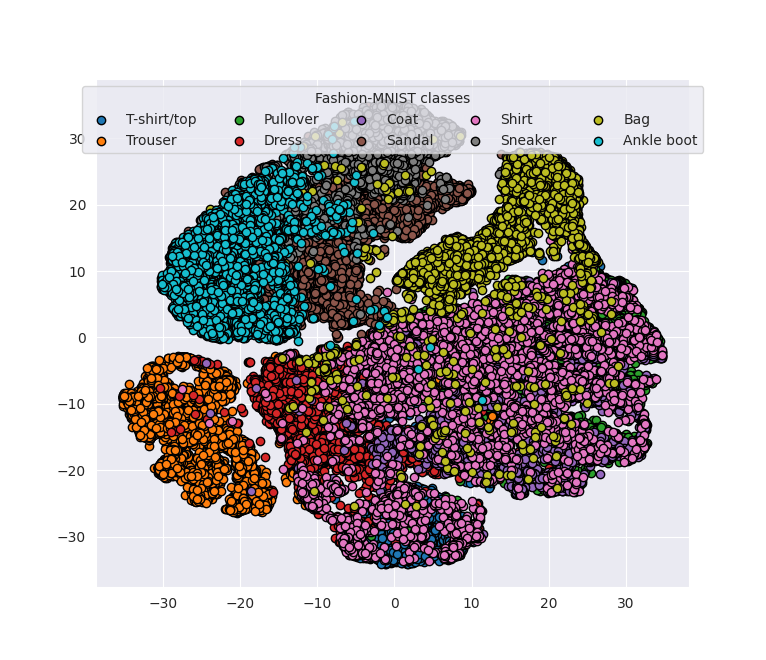

# PyTorch Datasets

[](https://badge.fury.io/py/pt-datasets)
[](https://www.gnu.org/licenses/agpl-3.0)
[](https://www.python.org/downloads/release/python-377/)
[](https://www.python.org/downloads/release/python-382/)

## Overview

This repository is meant for easier and faster access to commonly used
benchmark datasets. Using this repository, one can load the datasets in a
ready-to-use fashion for PyTorch models. Additionally, this can be used to load
the low-dimensional features of the aforementioned datasets, encoded using PCA,
t-SNE, or UMAP.

## Datasets

- MNIST
- Fashion-MNIST
- EMNIST-Balanced
- CIFAR10
- SVHN
- MalImg
- AG News
- 20 Newsgroups
- KMNIST
- Wisconsin Diagnostic Breast Cancer
- [COVID19 binary classification](https://github.com/lindawangg/COVID-Net)
- [COVID19 multi-classification](https://github.com/lindawangg/COVID-Net)

_Note on COVID19 datasets: Training models on this is not intended to produce
models for direct clinical diagnosis. Please do not use the model output for
self-diagnosis, and seek help from your local health authorities._

## Usage

It is recommended to use a virtual environment to isolate the project dependencies.

```shell script
$ virtualenv env --python=python3  # we use python 3
$ pip install pt-datasets  # install the package
```

We use the [`tsnecuda`](https://github.com/CannyLab/tsne-cuda) library for the
CUDA-accelerated t-SNE encoder, which can be installed by following the
[instructions](https://github.com/CannyLab/tsne-cuda/wiki/Installation) in its wiki.

But there is also a provided script for installing `tsne-cuda` from source.

```shell script
$ bash setup/install_tsnecuda
```

Do note that this script has only been tested on an Ubuntu 20.04 LTS system
with Nvidia GTX960M GPU.

We can then use this package for loading ready-to-use data loaders,

```python
from pt_datasets import load_dataset, create_dataloader

# load the training and test data
train_data, test_data = load_dataset(name="cifar10")

# create a data loader for the training data
train_loader = create_dataloader(
    dataset=train_data, batch_size=64, shuffle=True, num_workers=1
)

...

# use the data loader for training
model.fit(train_loader, epochs=10)
```

We can also encode the dataset features to a lower-dimensional space,

```python
import seaborn as sns
import matplotlib.pyplot as plt
from pt_datasets import load_dataset, encode_features

# load the training and test data
train_data, test_data = load_dataset(name="fashion_mnist")

# get the numpy array of the features
# the encoders can only accept np.ndarray types
train_features = train_data.data.numpy()

# flatten the tensors
train_features = train_features.reshape(
    train_features.shape[0], -1
)

# get the labels
train_labels = train_data.targets.numpy()

# get the class names
classes = train_data.classes

# encode training features using t-SNE with CUDA
encoded_train_features = encode_features(
    features=train_features,
    seed=1024,
    use_cuda=True,
    encoder="tsne"
)

# use seaborn styling
sns.set_style("darkgrid")

# scatter plot each feature w.r.t class
for index in range(len(classes)):
    plt.scatter(
        encoded_train_features[train_labels == index, 0],
        encoded_train_features[train_labels == index, 1],
        label=classes[index],
        edgecolors="black"
    )
plt.legend(loc="upper center", title="Fashion-MNIST classes", ncol=5)
plt.show()
```



## Citation

When using the Malware Image classification dataset, kindly use the following
citations,

- BibTex

```
@article{agarap2017towards,
    title={Towards building an intelligent anti-malware system: a deep learning approach using support vector machine (SVM) for malware classification},
    author={Agarap, Abien Fred},
    journal={arXiv preprint arXiv:1801.00318},
    year={2017}
}
```

- MLA

```
Agarap, Abien Fred. "Towards building an intelligent anti-malware system: a
deep learning approach using support vector machine (svm) for malware
classification." arXiv preprint arXiv:1801.00318 (2017).
```

## License

```
PyTorch Datasets utility repository
Copyright (C) 2020-2021  Abien Fred Agarap

This program is free software: you can redistribute it and/or modify
it under the terms of the GNU Affero General Public License as published
by the Free Software Foundation, either version 3 of the License, or
(at your option) any later version.

This program is distributed in the hope that it will be useful,
but WITHOUT ANY WARRANTY; without even the implied warranty of
MERCHANTABILITY or FITNESS FOR A PARTICULAR PURPOSE.  See the
GNU Affero General Public License for more details.

You should have received a copy of the GNU Affero General Public License
along with this program.  If not, see <https://www.gnu.org/licenses/>.
```
